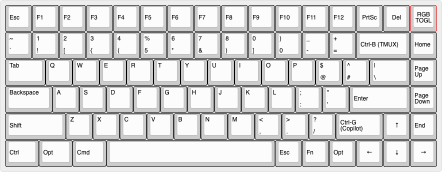
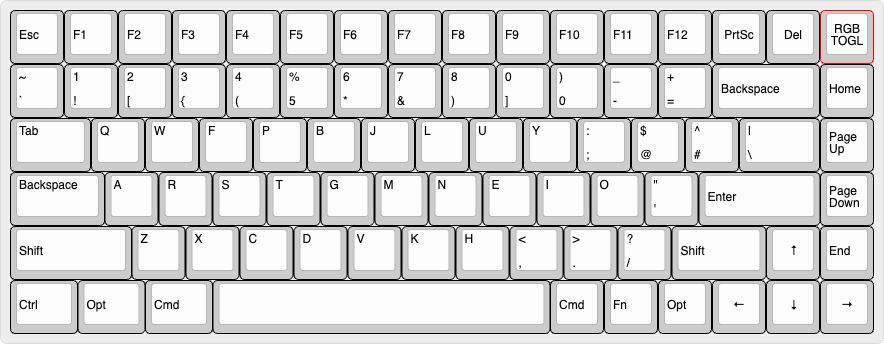

# Keychron K2 HE

Everything for my **Keychron K2 HE** (ANSI, RGB, Hall effect switches) in one
repo: my keymap, the exact firmware it builds against, and the Mac tools that
talk to the keyboard. Nothing here depends on Keychron's repositories staying
online.

---

## 📷 Layout

Mac base layer (QWERTY)


Windows base layer


---

## 🗂️ What's here

```
keyboards/keychron/k2_he/ansi/keymaps/mylayout/   my keymap (QMK external userspace)
  keymap.c, rules.mk
  features/custom_shift_keys.*                    custom shifted symbols
  features/key_signals.*                          host-controlled key colors
host/                                             keysignal: Mac service + CLI for key colors
firmware/                                         Keychron's QMK, pinned (submodule, my fork)
scripts/build, scripts/flash                      build, and flash with safety checks
backups/                                          firmware images read off the keyboard
qmk.json                                          tells QMK this repo is a userspace
```

`firmware/` points at [heydaytime/keychron-qmk_firmware](https://github.com/heydaytime/keychron-qmk_firmware)
on the `k2he` branch: Keychron's `2025q3` branch, plus one change that fetches
ChibiOS from my forks ([keychron-ChibiOS](https://github.com/heydaytime/keychron-ChibiOS),
[keychron-ChibiOS-Contrib](https://github.com/heydaytime/keychron-ChibiOS-Contrib)).
The exact firmware version is pinned, so Keychron updates never change a build
until I update the pin myself.

---

## 🛠️ Setup (macOS)

```bash
brew install qmk/qmk/qmk dfu-util
git clone --recursive git@github.com:heydaytime/k2he.git ~/k2he
```

No `qmk setup` is needed. The scripts always build against `firmware/`, whatever
QMK's global config points at.

## 💻 Build

```bash
scripts/build
```

The firmware lands at `keychron_k2_he_ansi_mylayout.bin` in the repo root. Every push
is also built on GitHub (Actions → Build → `firmware` artifact).

## ⚡ Flash

```bash
scripts/flash
```

It builds, checks the image, and waits for the keyboard in bootloader mode. To
enter bootloader mode: switch to cable mode, unplug, then hold **Esc** while
plugging back in. It then:

1. confirms exactly one device is in bootloader mode and that it's the K2 HE's 256KB STM32F401;
2. backs up what's on the keyboard to `backups/local/`;
3. writes the firmware;
4. waits for the keyboard to come back.

It refuses to write if any check fails.

- `scripts/flash --dry-run` does everything except the write.
- `scripts/flash --bin backups/<file>.bin` restores a backup.
- `backups/k2he-before-2025q3-20260928.bin` is what ran on the keyboard before the
  move to Keychron's `2025q3` firmware.

---

## 🚦 Key Signals

Programs on the computer can color any key green (good), yellow (warn) or red
(needs attention) over raw HID. Signals are held in RAM, can expire on their
own, and show only while the RGB backlight is on. Firmware side:
`keyboards/keychron/k2_he/ansi/keymaps/mylayout/features/key_signals.h`. On the
Mac, the [`keysignal`](host/README.md) service wraps this in a local HTTP API
and command line:

```bash
keysignal set f5 alert --pattern pulse --source ci --id deploy
```

`keysignal t3` gives each [T3 Code](https://github.com/pingdotgg/t3code) thread
its own F-key: amber while it works, red when it needs you, green when it's done
([setup](host/README.md#t3-code)).

Raw protocol: send a 32-byte report to the keyboard's raw HID interface (vendor
ID `0x3434`, usage page `0xFF60`, usage `0x61`). The keyboard echoes it back with
the status byte filled in.

| Byte | Meaning |
|---|---|
| 0 | `0x07` (VIA custom set value) |
| 1 | `0x00` (VIA custom channel) |
| 2 | command: `0x01` set, `0x02` clear all, `0x03` info |
| 3 | status in reply: `0` ok, `1` bad command, `2` bad key, `3` bad level/pattern |
| 4, 5 | set: key row, column (matrix position) |
| 6 | set: level `0` off, `1` good, `2` warn, `3` alert, `4` custom |
| 7 | set: pattern `0` solid, `1` blink, `2` pulse |
| 8, 9 | set: expiry in seconds, big endian, `0` = until cleared |
| 10–12 | set: r, g, b for the custom level |

Info replies with the protocol version, rows and columns in bytes 4–6.

---

## 📦 Releases

Tag a release to keep a permanent copy of everything:

```bash
git tag v2026.09.28 && git push origin v2026.09.28
```

GitHub then builds it and attaches two files to the release:
- the flashable `.bin`;
- a source archive with this repo, the firmware and every library it needs.

Even if every upstream repository and fork vanished, a release can still be
flashed and rebuilt.

## 🔄 Updating to newer Keychron firmware

```bash
cd firmware
git fetch https://github.com/Keychron/qmk_firmware 2025q3
git merge FETCH_HEAD                  # on the k2he branch
git submodule update --init --recursive
cd .. && scripts/build                # fix anything the update broke
git -C firmware push origin k2he
git add firmware && git commit -m "Update firmware to Keychron <date>"
```

If Keychron moved ChibiOS to a commit my forks don't have yet, sync them first:
`gh repo sync heydaytime/keychron-ChibiOS -b <branch>`, and the same for
`keychron-ChibiOS-Contrib`.
